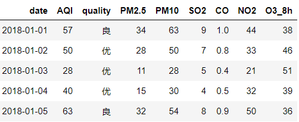
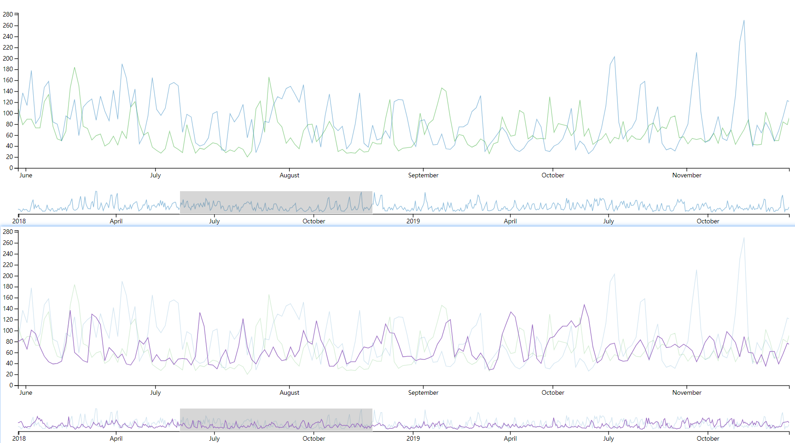
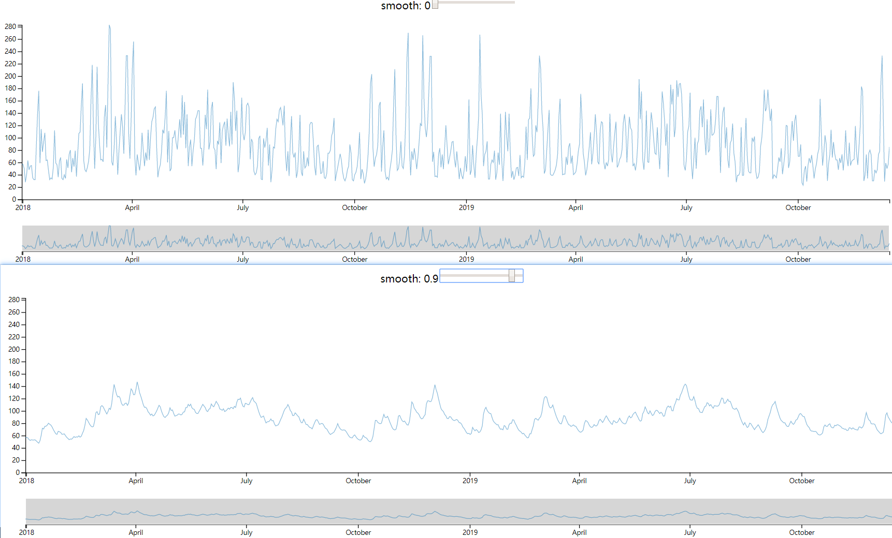
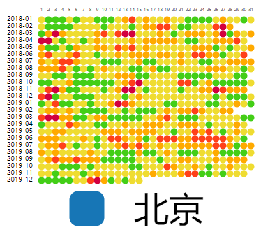
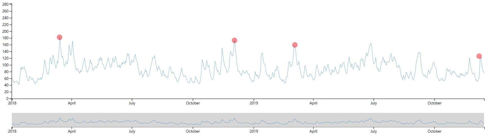
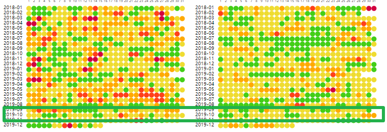
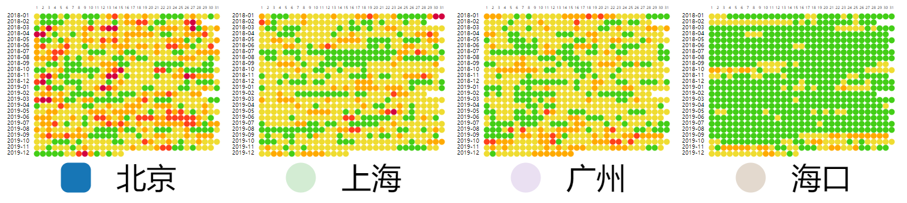
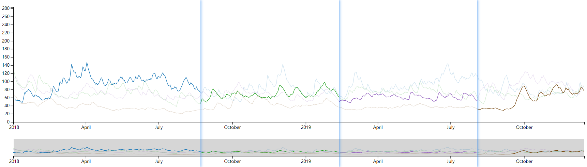
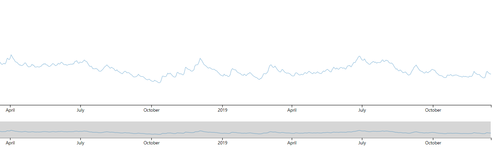

## visclass_f19_a03_report

#### 数据描述和分析：

- 选取的数据源为[www.aqistudy.cn](https://www.aqistudy.cn/)
  - 选择了北京、上海、广州、海口四个城市的空气质量进行分析，时间尺度从2018年1月1日-2019年12月15日（截止作业完成时）
- 数据项较多，包括date、AQI、PM2.5等等：
  - 
  - 为了方便分析一个地区综合的空气质量在时间尺度上的周期性变化，**我们选择较为综合的指标：AQI**，作为我们分析的主体
  - **AQI**为**定量型数据**，且其在时间尺度上较大可能具有周期性，因此我们采用**折线图**进行分析
  - **空气质量**等级 和AQI高度绑定，是**定性型数据**，我们使用**颜色**来区分不同的空气质量等级，并使用**热力图**的方法展现整体的空气质量等级情况
-  **可供分析的问题：**
  - 四个城市间的污染程度的比较
  - 空气质量与时间的关系
  - 随着时间推移空气质量的整体变化趋势

#### 设计介绍：

综合分析了数据特性后，我选择了折线图和热点图分别对定量型、定性型数据进行可视化，并通过**交互**将其联系起来

- **折线图**

  - 折线图支持brush和zoom，既有概览整体，又可观察细节

    

  - 通过不同颜色来表现不同城市，可以选择展示哪些城市，也可以高亮显示某一城市

    

    

  - 支持smooth操作，算法复现了tensorboard中的smooth方法，方便对整体趋势进行更合理的观察

    

- **热力图**

  - 通过不同颜色来表现空气质量，颜色来源于不同空气质量的警示图，越深表示空气越差

    

- **交互**

  - 通过选择热力图，可以在折线图中高亮显示该城市对应的AQI的变化，方便结合两图进行观察探究

#### 设计宗旨

- 选择这些数据分析的原因：
  - 最大程度保留数据信息，保留了定性型数据和定量型数据
  - 通过时间尺度上的观察，努力探究空气质量随时间的变化情况
  - 增加smooth方法，更方便判断曲线的变化趋势
- 设计的好处
  - 可以从定量和定性两个方面展现数据
  - 充分考虑交互性，方便使用者自行对数据进行探索
  - layout简练清晰，附加了tips，方便使用
  - 可以控制smooth，增加了图表的宏观表现力
- 设计的缺点
  - 由于展示区域过小，且数据量较大，图表整体尺寸较小，且折线图颜色容易混淆
  - 热力图的交互性不够出色
- 设计的难点
  - 交互性设计，包括brush、zoom
  - smooth算法的设计
  - 异步并行设计，由于js的特殊性，异步处理是一个比较重要的问题

#### 可视化结果描述

- 作品介绍可以参看上面的内容：**设计介绍**，该部分对设计思路进行了详细介绍和展示

- 发现：

  - **空气质量表现出较强的周期性**，在smooth较大时，我们可以观察到整体趋势中出现了较为明显的峰值

    

    以北京为例，在**三四月份 和 十二月份左右**空气质量较差，十二月份与供暖相关，三四月份可能和入春后风沙较大有关

    同时，在**十月份左右**，空气质量普遍较好，符合“秋高气爽”的直观体验

    而这一感受在热力图中也可表现出来

    

    

  - 整体的空气质量比较，**海口** 优于 **上海、广州** 优于 **北京**，这在两个图表中都有明显的体现

    

    

  - **整体空气质量呈现逐渐变好的趋势**，在较高smooth时，我们可以观察到整体的变化趋势

    

    

  - **整体观之，海口的空气质量*很赞*，相比于热闹但相对污浊的北上广，保守着一份洁净。**

